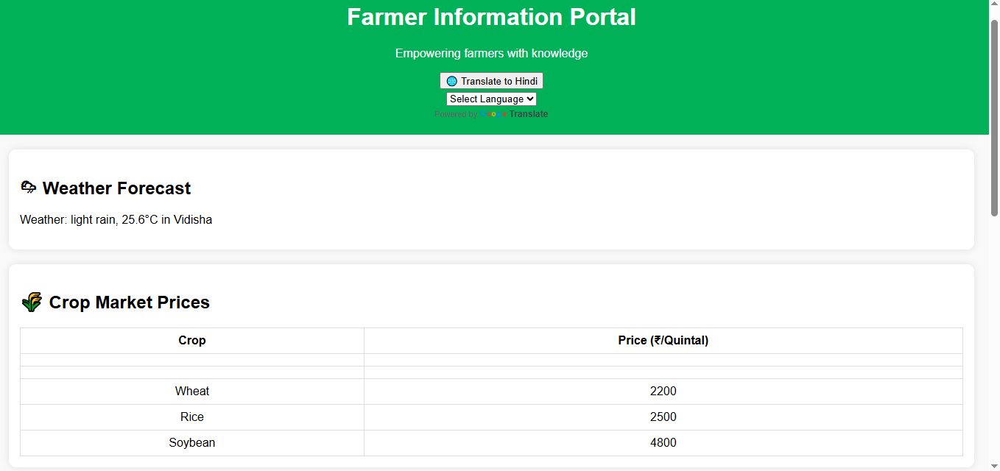

# 🌾 Farmer Information Portal

The **Farmer Info Portal** is a web-based application designed to provide essential and real-time information to farmers. It integrates weather updates, live crop pricing, language translation, and a feedback form — all in one place.

## 🚀 Features

- 🌦 **Weather Forecast:** Real-time weather updates using the OpenWeatherMap API.
- 📊 **Live Crop Prices:** Fetched and displayed from a linked Google Sheet.
- 🌐 **Language Support:** Translate the entire portal to Hindi for better accessibility.
- 📝 **Feedback Form:** Collect suggestions, queries, and feedback from users.

## 🛠️ Built With

- HTML, CSS, JavaScript  
- OpenWeatherMap API  
- Google Sheets API  
- Google Translate Widget  

## 📷 Preview

 

## 📬 Feedback

If you have any suggestions or want to contribute, feel free to open an issue or send a pull request!

---

© 2025 Neha Baghele
